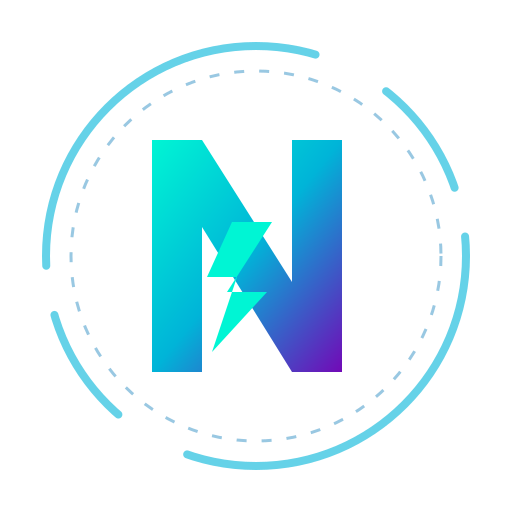

<div align="center">
  
  <h1>NixitOS</h1>
  <p><em>Un sistema operativo immutabile, minimale e ottimizzato per workload AI locali.</em></p>
</div>

---

## ⚠️ Disclaimer Importante

**ATTENZIONE**: Questa repository **NON** è intesa per l'uso pubblico o generale. 

NixitOS è una configurazione (basata su `bootc` e `blue-build`) creata in modo sartoriale **esclusivamente per una specifica configurazione hardware locale**. Contiene script, regole di modprobe e ottimizzazioni di sistema (come la gestione on-demand di eGPU NVIDIA via Thunderbolt e tuning della zRAM per modelli LLM) che potrebbero causare instabilità, kernel panic o mancati avvii su macchine diverse. 

**Non installare questa immagine sul tuo computer.**

---

## 🚀 Cos'è NixitOS?

NixitOS è un'immagine derivata da Fedora Silverblue 44, strutturata seguendo il paradigma GitOps tramite `bootc`. L'obiettivo principale è massimizzare l'efficienza del sistema per il caricamento e l'esecuzione di Large Language Models (LLM) tramite `llama.cpp` e tool simili, mantenendo un ambiente di base ("host") estremamente pulito e reattivo.

### Caratteristiche Principali

*   **Immutabilità & GitOps**: Ogni modifica al sistema operativo è tracciata in questa repository (nel `Containerfile` o in `build_files/`) e "buildata" in un'immagine container.
*   **Gestione Hardware Asimmetrica**:
    *   **Intel Arc (Lunar Lake)**: Supporto nativo integrato tramite `intel-compute-runtime` e `intel-level-zero` per l'accelerazione hardware (SYCL/Vulkan) a basso consumo.
    *   **NVIDIA eGPU (On-Demand)**: Driver NVIDIA presenti ma rigorosamente bloccati all'avvio (`blacklist`). L'eGPU viene attivata e disattivata manualmente tramite script dedicati (`egpu-up.sh` e `egpu-down.sh`) solo quando è richiesta la massima potenza di calcolo, garantendo consumi nulli quando non in uso.
*   **Minimalismo Estremo**:
    *   Pruning dei pacchetti ingombranti (come `glibc-all-langpacks`), mantenendo solo il supporto essenziale (En/It) per massimizzare lo spazio libero.
    *   **Rimozione di GNOME Software**: Per eliminare notifiche fastidiose e aggiornamenti automatici non desiderati. I Flatpak sono gestiti in modo pulito ed efficiente via terminale.
    *   Configurazione zRAM personalizzata: 16GB (50% della RAM) con algoritmo `zstd`. Questo fornisce un cuscinetto ad altissima compressione per il sistema operativo, lasciando la maggior parte della memoria fisica (32GB) libera per i pesi dei modelli LLM.
*   **Personalizzazione & Estetica**:
    *   **Tema Yaru**: Integrazione del tema Ubuntu Yaru (GTK, Icone, Suoni e Shell) per un'estetica moderna e curata.
    *   **GNOME Tweaks & User Themes**: Inclusione degli strumenti necessari per personalizzare profondamente l'interfaccia, inclusa la possibilità di cambiare il tema della Shell GNOME tramite l'estensione preinstallata.
*   **Tuning di Sistema**: Regolazioni `sysctl` per massimizzare la reattività dello swap, ottimizzare i buffer di rete e supportare carichi di lavoro intensivi tramite container (Podman/Distrobox).

## 🛠 Struttura della Repository

*   `Containerfile`: La "ricetta" principale per la costruzione dell'immagine basata su `ghcr.io/blue-build/base-images/fedora-silverblue-nvidia:44`.
*   `build_files/`: Directory copiata direttamente nella root `/` del sistema. Contiene script personalizzati, configurazioni kernel (`modprobe.d`, `sysctl.d`) e temi.
*   `.github/workflows/`: Pipeline CI/CD per generare automaticamente la nuova immagine ad ogni commit.
*   `.antigravity/skills/`: Contiene la skill `nixitos-optimizer`, utilizzata per l'analisi e la manutenzione automatizzata dell'efficienza della codebase.

---

## 🔒 Criptazione del Disco con TPM 2.0

NixitOS include il supporto nativo per la cifratura del disco LUKS2 automatizzata tramite il chip TPM 2.0 del sistema. Questo permette di sbloccare il disco all'avvio in modo sicuro senza dover digitare la passphrase ogni volta, a patto che la catena di boot sia integra.

Poiché NixitOS è un sistema immutabile basato su `bootc`, la cifratura del disco non può essere abilitata in modo sicuro "in-place" su un'installazione esistente non crittografata. È richiesta una nuova installazione pulita.

### 1. Installazione con Cifratura
1. Avvia l'installer di NixitOS o Fedora Silverblue.
2. Durante la configurazione del partizionamento, assicurati di spuntare l'opzione **"Encrypt my data"** (Cifra i miei dati) e imposta una passphrase robusta (questa sarà la tua chiave di recupero/fallback).
3. Completa l'installazione e avvia il sistema.

### 2. Configurazione e Abilitazione dracut nel Containerfile
Per garantire che i moduli per la gestione del TPM siano presenti all'avvio, l'immagine di NixitOS forza l'inclusione dei moduli necessari tramite la configurazione dracut personalizzata [tpm2.conf](build_files/etc/dracut.conf.d/tpm2.conf):
```text
add_dracutmodules+=" crypt tpm2-tss "
```
*Questo file viene integrato automaticamente in ogni nuova build dell'immagine.*

### 3. Registrazione della Chiave nel TPM
Una volta installato il sistema crittografato, puoi associare la chiave LUKS al chip TPM 2.0:

1. Identifica la tua partizione LUKS crittografata (solitamente di tipo `crypto_LUKS` su `/dev/nvme0n1p3` o simile):
   ```bash
   lsblk -f
   ```
2. Associa il dispositivo LUKS al chip TPM usando `systemd-cryptenroll`. Si raccomanda di utilizzare solo il **PCR 7** (che verifica lo stato del Secure Boot) ed eventualmente il **PCR 0** (firmware UEFI):
   ```bash
   sudo systemd-cryptenroll --tpm2-device=auto --tpm2-pcrs=7 /dev/nvme0n1p3
   ```
   > [!WARNING]
   > **Non utilizzare i PCR 8 o 9** su sistemi `bootc`/Silverblue. Questi registri tracciano la riga di comando del kernel e l'initramfs. Poiché gli aggiornamenti di NixitOS scaricano nuovi kernel e initramfs integrati nell'immagine, l'uso dei PCR 8/9 invaliderebbe lo sblocco automatico ad ogni aggiornamento di sistema (`bootc update`), costringendoti a inserire manualmente la passphrase ad ogni avvio.

### 4. Sblocco Automatico Zero-Config (Filosofia Atomica & GitOps)
In linea con la filosofia atomica e immutabile di NixitOS, **non è necessario (ed è sconsigliato) modificare manualmente il file `/etc/crypttab` sull'host**. 

Grazie al meccanismo di **Discoverable Partitions Specification (DPS)** e all'integrazione di `systemd-gpt-auto-generator` in Fedora/systemd:
1. Se il disco utilizza lo schema GPT standard (configurazione predefinita dell'installer Anaconda), la partizione root cifrata possiede già il tipo GUID corretto per Linux.
2. `systemd-cryptenroll` scrive i metadati del token TPM direttamente nell'header JSON della partizione LUKS2 (i metadati viaggiano con la partizione stessa, senza bisogno di configurazioni esterne).
3. All'avvio, `systemd` rileva automaticamente la partizione LUKS, legge il token TPM2 dal suo header e, tramite i moduli che abbiamo pre-compilato nell'immagine NixitOS, esegue lo sblocco automatico.

Questo garantisce un'installazione **completamente stateless e dichiarativa**, libera da deviazioni di configurazione ("configuration drift") sui singoli host.

*Nota: Nel caso in cui si utilizzi uno schema di partizionamento non standard o non-GPT, è possibile ricorrere alla dichiarazione classica in `/etc/crypttab` sull'host aggiungendo l'opzione `tpm2-device=auto` come fallback, ma per una gestione pura GitOps si raccomanda l'approccio DPS automatico.*

---


## 📄 Licenza

Questo progetto è rilasciato sotto i termini della licenza **GNU General Public License v3.0 (GPL-3.0)**. 

Essendo NixitOS una configurazione strettamente legata all'hardware dell'autore, la licenza garantisce la libertà di studio e modifica, ma si ribadisce il disclaimer: l'uso su hardware diverso è a totale rischio dell'utente. Consulta il file [LICENSE](LICENSE) per il testo completo della licenza.

